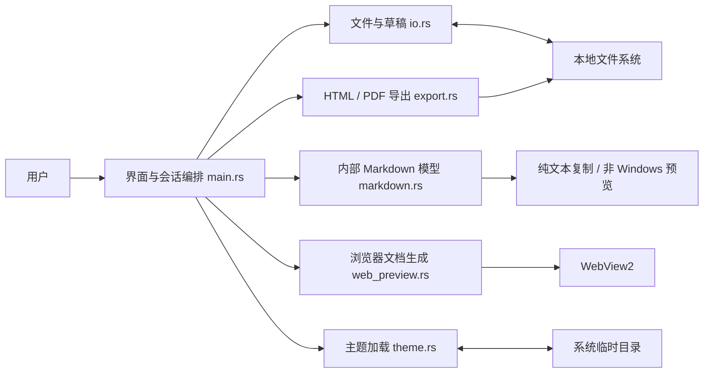
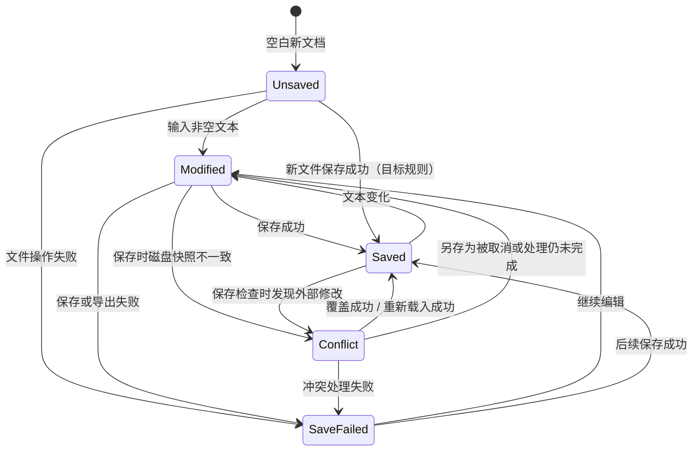

# Markdown 编辑器与预览器：可执行设计说明

> 文档状态：当前实现基线
>
> 对应版本：v0.1.8
>
> 更新日期：2026-08-11
>
> 事实来源：`src/`、`Cargo.toml`、现有自动化测试和发布包

## 记录目的

这份文档把产品目标转换为数据定义、状态变化、接口契约、失败处理和验收案例。开发时以代码和测试验证这些规则；代码与文档不一致时，先标出差异，再决定修改实现或修改规则。

文档使用以下设计顺序：

1. 重新表述问题，明确目标、范围、输入、输出和约束。
2. 定义系统处理的数据、状态、关系和不变量。
3. 为关键操作写契约、推进规则和停止条件。
4. 划分模块边界，集中管理易变知识。
5. 记录关键取舍及重新评估条件。
6. 为正常、边界和失败场景提供可执行测试。

## 1. 问题定义

### 1.1 用户与目标

主要用户是在 Windows 上编写本地 Markdown 文件的个人用户。系统让用户在一个窗口内完成写作、浏览器级预览、主题检查、保存和导出，减少编辑器与浏览器之间的切换。

一次编辑会话成功时，用户可以完成以下闭环：

1. 打开或输入 UTF-8 Markdown 文本。
2. 在写作、阅读或分栏模式中检查内容。
3. 使用导入主题查看浏览器渲染结果。
4. 安全保存文件；磁盘内容被外部程序修改时，由用户决定如何处理。
5. 导出 HTML 或 PDF，或复制纯文本和 HTML。

### 1.2 当前范围

已实现：

- 单窗口、多文件标签编辑；每个标签独立维护文本、路径、解析结果、保存状态和冲突状态。
- 写作、阅读、分栏和专注模式。
- CommonMark 基础语法，以及表格、脚注、删除线、任务列表、围栏代码块和 Mermaid 图表。
- Windows 上使用 WebView2 生成实时预览；只允许内置 Mermaid 运行库和固定启动脚本执行 JavaScript。
- 导入 `.css`、`.json` 和包含 CSS/JSON 的 `.zip` 主题包。
- 内置少数派经典 CSS；围栏代码块显示语言标签。
- 统一字体：英文和代码使用 JetBrains Mono，中文回退到霞鹜文楷轻便版。
- 设置编辑区与预览区正文字号。
- 打开、保存、另存为、外部修改冲突处理和临时草稿恢复。
- 导出 HTML、导出 PDF、复制纯文本和复制 HTML。

当前不包含：

- 多人协作、云端同步、评论、版本历史和插件运行时。
- 所见即所得编辑；编辑区始终保存 Markdown 源文本。
- Windows WebView2 预览与编辑区的双向滚动同步。
- 导出文件完整复用当前预览主题。
- 对非 UTF-8 文件进行编码转换。

### 1.3 输入、输出与外部依赖

| 类别 | 内容 | 边界规则 |
| --- | --- | --- |
| 用户输入 | 键盘输入、粘贴、菜单和快捷键 | 编辑区文本是文档内容的唯一可编辑来源 |
| 文档输入 | 一个或多个 `.md`、`.markdown`、`.txt` 文件 | 文件选择器支持多选并按扩展名筛选；读取层只强制 UTF-8 和 10 MiB 上限 |
| 主题输入 | `.css`、主题 `.json`、`.zip` | ZIP 内单个候选条目不得超过 2 MiB；不解压到磁盘 |
| 文档输出 | Markdown、HTML、PDF、剪贴板内容 | 写入失败时保留编辑区文本 |
| 临时状态 | 草稿和已导入主题 | 当前保存在系统临时目录，可能被系统清理 |
| 运行依赖 | Windows 10/11、WebView2 Runtime；内置 Mermaid 11.16.0 | WebView2 不可用时浏览器预览无法创建；图表渲染不依赖网络 |

### 1.4 可判断的质量要求

| 编号 | 触发条件 | 要求 | 验证状态 |
| --- | --- | --- | --- |
| Q1 | 打开大小不超过 10 MiB 的有效 UTF-8 文件 | 原编辑内容只在完整读取成功后被替换 | 已有单元测试覆盖大小和编码边界；需要补充界面级测试 |
| Q2 | 打开大于 10 MiB 的文件 | 拒绝读取并显示大小限制；原编辑内容不变 | 已有单元测试 |
| Q3 | 保存前磁盘内容与打开时快照不同 | 不自动覆盖，进入冲突状态并给出覆盖、另存为、重新载入三种选择 | 已有冲突检测单元测试；需要补充三条界面路径 |
| Q4 | 文本包含支持的 Markdown 结构 | 预览生成对应 HTML；代码围栏内容不再解析为标题或链接 | 已有解析、HTML、表格、主题和代码语言测试 |
| Q5 | 文本或主题没有变化 | WebView2 不重复加载同一 HTML | 由文档哈希控制；需要加入行为测试或计数器 |
| Q6 | 普通编辑文档发生输入 | 预览在用户可感知的短时间内更新 | 当前没有基准数据；建立 100 KiB、1 MiB、10 MiB 三档性能测试后再填写阈值 |
| Q7 | 应用离线启动 | 内置字体、内置主题和 Mermaid 图表可用 | 字体、CSS 与 Mermaid 已嵌入可执行文件；外部主题中的远程资源不受此承诺约束 |

## 2. 系统边界与模块关系



Windows 当前有两条渲染路径：

1. `markdown.rs` 把文本转换为内部 `Block`/`Inline` 模型，用于复制纯文本、测试和非 Windows 后备预览。
2. `web_preview.rs` 直接使用 `pulldown-cmark` 生成 HTML，再交给 WebView2 执行主题 CSS。

两条路径共享解析选项，但不共享同一个 AST。新增语法时必须同时检查两条路径，防止复制结果、后备预览和 Windows 预览出现差异。

## 3. 数据、状态与不变量

### 3.1 文档标签 `DocumentTab`

`MdEditorApp.tabs` 保存全部标签，`active_tab` 指向当前标签。当前标签的数据会加载到应用工作字段中，切换或关闭前再写回对应 `DocumentTab`。

| 字段 | 类型或取值 | 含义 |
| --- | --- | --- |
| `id` | 递增整数 | 标签的稳定界面标识，不因标题重复而冲突 |
| `text` | UTF-8 字符串 | 当前编辑区完整内容，文档的内存事实源 |
| `path` | 路径或空 | 空表示未绑定磁盘文件 |
| `disk_snapshot` | 字节数组 | 最近一次成功打开或保存后的文件字节，用于冲突检测 |
| `status` | `Unsaved / Saved / Modified / Conflict / SaveFailed` | 当前文档或最近一次操作的状态 |
| `last_parsed` | 字符串 | 最近一次生成内部块模型时使用的文本 |
| `blocks` | `Vec<Block>` | 内部 Markdown 解析结果 |
| `conflict` | 路径或空 | 等待用户处理的冲突文件 |
| 草稿计时字段 | 时间值 | 记录该标签最后编辑和最后草稿写入时间 |

应用级数据还包括 `active_tab`、下一个标签编号和待关闭标签。`recovery` 目前仍是应用级单条草稿，尚未按标签拆分。

`SaveFailed(String)` 目前同时承载文件、导出和主题错误。后续如果错误处理继续扩展，应拆成带操作类型的错误数据，避免状态栏无法判断失败来源。

### 3.2 文档状态机



状态含义：

- `Unsaved`：没有绑定路径且文本为空。
- `Saved`：内存文本与最近一次成功读写得到的快照一致。
- `Modified`：内存文本与快照不同，或未绑定路径但文本非空。
- `Conflict`：保存检查发现当前磁盘字节与快照不同。
- `SaveFailed`：最近一次文件、导出或主题操作失败；错误文本可见。

`Saved` 只说明内存文本与应用保存的快照一致。外部程序随后仍可能修改磁盘文件，系统会在下一次保存时发现变化。

### 3.3 Markdown 数据

块级数据包括标题、段落、列表、代码块、引用、表格、分隔线和原始内容。行内数据包括文本、强调、加粗、删除线、代码、链接、图片和换行。

递归关系如下：

- 列表包含多个列表项，每个列表项继续包含块。
- 引用包含块。
- 强调、加粗、删除线和链接包含行内内容。
- 表格包含表头、行和单元格；单元格包含行内内容。

解析器按输入事件顺序维护栈。遇到开始事件时压入当前结构，遇到结束事件时完成当前结构并加入父级。输入事件耗尽时停止。

### 3.4 主题数据 `ThemePackage`

主题包包含名称、作者、原始 CSS、亮色与暗色色板、排版参数。浏览器预览的 CSS 优先级固定为：

1. 结构后备样式；只为表格等结构提供最低可用样式。
2. 用户导入或内置的原始主题 CSS。
3. DOM 兼容规则、内置字体规则和用户字号覆盖。

第 3 层会改写主题的字体、代码块 DOM 适配、代码语言标签和列表缩进。这里的“忠实执行主题”指主题 CSS 不经过转换，并在浏览器引擎中执行；兼容层声明的属性属于明确例外。新增例外必须写入本节并加入回归测试。

ZIP 主题的选择规则：

1. 按 ZIP 条目顺序扫描。
2. 跳过目录、超过 2 MiB 的条目和非 CSS/JSON 文件。
3. 找到第一个有效主题 JSON 时立即使用。
4. 没有有效 JSON 时使用第一个 CSS。
5. 没有可用候选项时返回错误，保留当前主题。

### 3.5 视图与浏览器状态

| 数据 | 取值 | 规则 |
| --- | --- | --- |
| `view_mode` | 写作 / 阅读 / 分栏 | 决定编辑器和 WebView2 是否可见 |
| `focus_mode` | 开 / 关 | 开启后隐藏顶部和底部栏 |
| `body_font_size` | 12–22 px，步长 0.5 | 同时传给编辑区与浏览器兼容层 |
| `dark` | 开 / 关 | 影响应用外壳和编辑区；外部 CSS 是否支持深色由主题自身决定 |
| `BrowserPreview.document_hash` | 64 位哈希 | 文档哈希不变时不重复调用 `load_html` |
| `BrowserPreview.bounds` | 物理像素矩形 | 窗口尺寸变化时更新子 WebView2 位置 |
| `BrowserPreview.frozen_frame` | 可选的 egui 纹理 | 菜单或模态窗口打开前保存当前预览像素；弹出层关闭后立即释放 |

### 3.6 不变量

每次操作结束后必须满足：

1. `text` 始终是用户当前内容；打开、重新载入等替换操作只有在读取完整成功后才修改它。
2. 保存冲突未解决前，不自动覆盖磁盘内容。
3. 保存或导出失败时，不清空 `text`。
4. `last_parsed == text` 时，`blocks` 必须来自这份文本。
5. 浏览器文档的 Markdown 来源必须是当前 `text`，主题来源必须是当前选中的主题或内置主题。
6. 主题导入失败时，当前主题和字号不变。
7. 恢复草稿只修改内存文本，不直接写入原文件。
8. WebView2 只允许从 `https://mdfont.localhost` 加载内置 Mermaid 运行库和固定启动脚本；CSP 禁止行内脚本、Markdown/主题脚本及对象嵌入。
9. 切换标签前必须把当前工作字段写回原标签；切换后，编辑器、状态栏、复制、导出和预览必须全部读取新标签。
10. 关闭有修改或冲突的标签前必须获得用户的保存、放弃或取消选择；关闭最后一个标签后自动创建空白标签。
11. 菜单或模态窗口打开时可以暂时隐藏原生 WebView2，但必须在原阅读区域显示最近一次预览快照；弹出层关闭后恢复实时预览。

## 4. 关键操作规则

### 4.1 编辑到预览

**契约**

- 输入：修改后的 UTF-8 `text`、当前主题、字号和文档目录。
- 输出：更新后的内部块模型；预览可见时生成新的浏览器文档。
- 失败：WebView2 创建、移动或加载失败时写入状态提示，编辑内容保持不变。
- 未承诺：当前没有语法错误诊断；解析器会尽量为任意文本生成结果。

**推进规则**

1. 每次界面更新比较 `text` 和 `last_parsed`。
2. 两者不同则解析全部文本，替换 `blocks` 和 `last_parsed`，刷新文档状态并记录最后编辑时间。
3. 预览可见时，从当前文本、CSS、文档目录和字号生成完整 HTML。
4. `mermaid` 围栏由内置 Mermaid 以 `securityLevel: strict` 渲染成 SVG；语法失败时保留源代码并显示局部错误。
5. HTML 哈希变化时调用 WebView2 `load_html`；哈希相同时结束。
6. 编辑区拥有焦点时，把焦点从子 WebView2 交还父窗口，保证左侧可继续输入。

当前实现每次变化都做全量解析和全量 HTML 生成。文件规模或刷新时间超过性能目标时，再评估防抖、增量解析或局部更新。

### 4.2 标签创建、切换与关闭

**契约**

- 新建：创建空文本、无路径、`Unsaved` 状态的标签并设为当前标签。
- 打开：文件读取成功后追加新标签；一次文件对话框可以选择多个文件。
- 重复打开：路径与现有标签相同时切换到已有标签，不创建副本。
- 切换：先保存当前标签的内存状态，再加载目标标签；共享同一个 WebView2 实例并刷新当前内容。
- 关闭：无修改标签直接关闭；有修改或冲突的标签显示“保存并关闭 / 放弃修改 / 取消”。
- 最后一个标签关闭：立即创建一个空白标签，应用保持可编辑。

快捷键为 `Ctrl+N` 新建、`Ctrl+W` 关闭、`Ctrl+Tab` 下一个标签、`Ctrl+Shift+Tab` 上一个标签。标签过多时，顶部区域横向滚动且隐藏滚动条。

标签栏使用扁平层级：当前标签以正文底色和中性底线标识，未保存状态使用小圆点，关闭符号位于标签内部；关闭符号只在当前标签或鼠标悬停时显示。菜单、标签与视图切换不使用高饱和度填充色。

顶部菜单、标签标题和视图切换统一使用与下拉菜单正文一致的 16 px 字号；交互区域统一为 34 px 高，并在 40 px 顶部栏内垂直居中。当前标签和当前视图的底线使用同一纵向基准。

### 4.3 打开文件

**契约**

- 输入：用户选择的路径或启动参数中的路径。
- 成功输出：UTF-8 文本、绑定路径、磁盘快照和 `Saved` 状态。
- 失败输出：`TooLarge`、`InvalidUtf8` 或 I/O 错误；原文本、路径和快照不变。

**处理步骤**

1. 读取元数据并检查 `size <= 10 * 1024 * 1024`。
2. 读取全部字节并验证 UTF-8。
3. 去掉开头的 UTF-8 BOM。
4. 全部成功后一次性替换会话数据，清除临时草稿并触发预览刷新。

文件选择器的扩展名只用于筛选，不构成安全规则。命令行路径和内部调用可以打开其他扩展名，只要内容通过大小和 UTF-8 校验。

### 4.4 保存与冲突处理

**契约**

- 输入：当前路径、`text` 和 `disk_snapshot`。
- 成功输出：磁盘内容等于 `text`，快照更新为写入字节，状态为 `Saved`，相关临时草稿清除。
- 冲突输出：磁盘内容保持不变，状态为 `Conflict`。
- I/O 失败输出：磁盘可能保持原状；`text` 不变；状态为 `SaveFailed`。

| 当前情况 | 事件 | 动作 | 结果 |
| --- | --- | --- | --- |
| 已绑定路径，磁盘字节等于快照 | 保存 | 写入当前文本 | `Saved` |
| 已绑定路径，磁盘字节不等于快照 | 保存 | 拒绝写入并显示冲突窗口 | `Conflict` |
| 冲突中 | 覆盖保存 | 不比较快照，直接写入 | 成功后 `Saved` |
| 冲突中 | 另存为 | 选择新路径并写入 | 成功后 `Saved` |
| 冲突中 | 重新载入 | 读取当前磁盘文件并替换内存文本 | 成功后 `Saved` |
| 未绑定路径 | 保存 | 选择新路径并创建文件 | 成功后 `Saved` |

新文档保存会走创建文件路径，不先读取尚不存在的目标文件。冲突状态下取消“另存为”会保留原冲突路径和冲突窗口。

### 4.5 草稿保存与恢复

**契约**

- 触发：文档未处于 `Saved`、文本非空、最后输入后空闲超过 30 秒、距离上次草稿写入超过 30 秒。
- 输出：把当前文本写入系统临时目录的固定草稿文件。
- 恢复：启动时读到非空 UTF-8 草稿则询问用户；恢复只写入编辑区，放弃则删除草稿。

当前只有一个全局草稿文件，不记录标签编号、源路径、时间和应用版本。自动保存只处理当前标签；快速切换后，其他未保存标签可能没有独立恢复记录。多标签的正常关闭已有逐标签确认，异常退出恢复仍需改为带标签标识和元数据的草稿集合。

### 4.6 导入主题

**契约**

- 输入：CSS、主题 JSON 或 ZIP 路径。
- 成功输出：主题数据写入临时配置文件，当前主题和推荐字号更新，预览刷新。
- 失败输出：显示具体错误，当前主题保持不变。
- 安全边界：主题和 Markdown 不能执行 JavaScript；只有内置 Mermaid 脚本获 CSP 许可。CSS 中的 `url()` 仍可能请求本地或远程资源。

导入主题是边界转换。`theme.rs` 负责把外部格式转换为统一的 `ThemePackage`，界面和预览不直接分析 ZIP 或 JSON 细节。

### 4.7 导出与复制

| 操作 | 输入 | 输出 | 失败处理 |
| --- | --- | --- | --- |
| 复制渲染内容 | 内部 `blocks` | 剪贴板纯文本 | 当前没有可见错误结果 |
| 复制 HTML | 当前 `text` | Markdown 转换后的 HTML 片段 | 当前没有可见错误结果 |
| 导出 HTML | 当前 `text`、目标路径 | 带基础样式的完整 HTML 文件 | 显示错误，文本不变 |
| 导出 PDF | 当前 `text`、目标路径、内置字体 | PDF 文件 | 显示错误，文本不变 |

当前导出样式由 `export.rs` 固定生成，不复用 WebView2 中的主题 CSS。验收时应把“预览正确”和“导出与预览一致”分开；后者目前没有实现。

## 5. 模块职责与接口契约

| 模块 | 拥有的知识 | 主要接口 | 允许变化的内容 |
| --- | --- | --- | --- |
| `main.rs` | 会话状态、界面布局、快捷键、操作编排 | `open_path`、`save`、`import_theme`、`App::ui` | 菜单、视图模式、状态转移 |
| `io.rs` | 文件大小、UTF-8、磁盘快照、草稿位置 | `read_markdown`、`save_with_conflict_check`、`save_draft` | 文件校验和冲突策略 |
| `markdown.rs` | 内部块与行内模型、解析选项、纯文本提取 | `parse`、`plain_text` | Markdown 语法和内部 AST |
| `web_preview.rs` | HTML 生成、CSS 层叠、内置资源协议、Mermaid 启动、弹出层快照和 WebView2 生命周期 | `document`、`BrowserPreview::show/hide/freeze_for_overlay` | 浏览器 DOM 兼容、图表渲染、原生层级规避和预览更新 |
| `theme.rs` | 主题包结构、外部格式转换、主题持久化 | `ThemePackage::from_file`、`load_saved` | CSS/JSON/ZIP 规则和布局参数 |
| `export.rs` | HTML/PDF 生成和字体资源 | `render_html`、`export_html`、`export_pdf` | 导出格式和排版 |
| `preview.rs` | 非 Windows 的 egui 后备预览 | `show_preview_with_theme` | 后备渲染布局 |

关键接口的受限契约：

| 接口 | 输入 | 返回 | 失败 | 调用方不能依赖 |
| --- | --- | --- | --- | --- |
| `read_markdown(path)` | 文件路径 | 去 BOM 的 UTF-8 文本 | 超限、非 UTF-8、I/O | 具体读取次数和缓冲方式 |
| `save_with_conflict_check(path,text,snapshot)` | 路径、文本、原快照 | 新快照 | 外部修改、I/O | 冲突比较未来是否改用哈希或元数据 |
| `parse(markdown)` | 任意 UTF-8 文本 | 块列表 | 当前为总函数，不返回语法错误 | 解析器内部栈结构 |
| `document(markdown,css,base,size)` | 文本、主题和上下文 | 完整 HTML | 当前为总函数 | DOM 注解的具体实现 |
| `BrowserPreview::show(...)` | 窗口、区域、HTML | 成功或错误文本 | WebView2 创建、定位、加载失败 | WebView2 句柄和哈希算法 |
| `ThemePackage::from_file(path)` | 外部主题文件 | 内部主题包 | 格式、编码、ZIP、字段或颜色错误 | 外部文件的原始目录结构 |

## 6. 设计取舍记录

| 决策 | 当前选择 | 得到的结果 | 接受的代价 | 重新评估条件 |
| --- | --- | --- | --- | --- |
| 编辑与预览技术 | egui 原生编辑器 + WebView2 子窗口 | 编辑输入简单稳定；浏览器可直接执行 CSS | 焦点、层级、滚动同步和跨平台更复杂 | 需要移动端、Linux/macOS 一致体验或富文本编辑 |
| 主题执行 | 原始 CSS + 小型兼容层 | 传统 Typora/nvALT CSS 更容易复用 | 兼容层可能覆盖主题属性 | 用户主题持续出现不可接受的差异时，改为可配置兼容规则 |
| 文档数量 | 单窗口多标签，共享预览实例 | 可同时编辑多个文件，切换成本低 | 活动状态需要写回；异常恢复必须区分标签 | 需要并排窗口、标签拖拽或跨窗口移动时重新划分会话层 |
| 冲突判断 | 比较完整字节快照 | 规则客观，不依赖文件时间精度 | 大文件保存前多一次完整读取 | 文件上限提高或保存延迟超标 |
| 预览更新 | 文本变化后全量生成 HTML | 实现清楚，结果确定 | 大文档可能重复计算和重载 | 性能基准不达标时引入防抖或增量方案 |
| 字体 | 字体文件嵌入应用 | 中英文排版一致、离线可用 | 包体积增加 | 安装包体积成为主要约束 |
| 临时持久化 | 系统临时目录中的单文件 | 无需配置数据库 | 可能被清理，且不能区分多个文档 | 需要可靠恢复、多文档或跨版本迁移 |

## 7. 故障、恢复与观察

| 故障 | 用户看到什么 | 影响范围 | 当前隔离与恢复 | 需要补充的观察信息 |
| --- | --- | --- | --- | --- |
| 文件不存在或无权限 | 状态栏显示读取或保存失败 | 当前文件操作 | 保留编辑区内容，用户可重试或另存为 | 操作类型、路径、OS 错误码 |
| 文件超过 10 MiB | 显示大小限制 | 本次打开 | 拒绝载入，保留原会话 | 实际大小和限制值 |
| 非 UTF-8 文件 | 显示编码无法识别 | 本次打开 | 拒绝载入 | 文件路径和检测结果 |
| 外部修改冲突 | 弹出三种处理选择 | 当前文档保存 | 不自动覆盖；由用户覆盖、另存或重载 | 原快照、当前磁盘摘要和选择结果 |
| WebView2 不可用 | 状态提示预览创建失败 | 阅读区和分栏预览 | 编辑和文件操作继续可用 | WebView2 错误、系统版本和运行时版本 |
| 主题格式无效 | 显示导入错误 | 当前主题切换 | 保留旧主题 | 文件类型、ZIP 候选项和解析错误 |
| 主题远程资源不可用 | 图片或字体缺失 | 当前预览排版 | 内置字体仍可用；主题资源自行降级 | 目前没有网络请求日志 |
| Mermaid 语法无效 | 原代码块保留，并在下方显示语法错误 | 当前图表 | 其他正文和图表继续渲染；修改语法后随预览刷新恢复 | 图表序号和 Mermaid 错误消息 |
| 菜单覆盖阅读区 | WebView2 暂时隐藏，原位置显示静态预览快照，菜单保持可见 | 当前阅读区的交互暂停 | 菜单关闭后释放快照并恢复实时 WebView2 | 快照捕获是否成功、弹出层开关和预览区域 |
| HTML/PDF 导出失败 | 状态栏显示导出失败 | 本次导出 | 文档与预览不变，可换路径重试 | 输出路径、阶段和底层错误 |
| 进程异常结束 | 下次启动可能出现草稿恢复 | 最近一次草稿之后的输入 | 恢复最近一次成功写入的草稿 | 草稿时间和源路径目前未记录 |

恢复后的检查规则：

1. 冲突覆盖成功后，重新读取的磁盘字节应等于新快照。
2. 冲突重新载入成功后，`text`、`disk_snapshot` 和磁盘字节应一致。
3. 草稿恢复后，原文件不得发生写入；只有用户再次保存才改变磁盘。
4. WebView2 恢复可用后，下一次显示应加载当前文本生成的文档。

当前应用没有结构化日志、指标和追踪。排查依赖状态栏错误和可复现输入。出现无法稳定复现的预览、保存或导出问题时，应先加入操作阶段、输入规模、耗时和底层错误记录。

## 8. 示例与测试

### 8.1 可执行示例

| 类别 | 输入或前置条件 | 预期结果 | 当前证据 |
| --- | --- | --- | --- |
| 空文档 | `text == ""` | 内部块列表为空；允许保存为空文件 | 解析测试已覆盖；新文件保存路径待修复 |
| 普通结构 | 标题、段落、列表、链接 | 生成对应块和 HTML 元素 | 解析和导出测试已覆盖 |
| 多标签状态 | 两个文件分别修改其中一个 | 只有被修改标签显示圆点；切换后文本、路径和状态各自保持 | 标签状态单元测试和窗口截图已覆盖 |
| 标签关闭 | 修改标签后点击关闭 | 显示保存、放弃和取消；取消后标签与内容保留 | 逻辑已实现；需要补充自动化界面测试 |
| 代码边界 | 围栏代码内包含 `#`、`**`、链接语法 | 内容保持代码文本；右上角显示声明语言 | 导出和 WebView 测试已覆盖 |
| Mermaid 状态图 | `mermaid` 围栏包含 `stateDiagram-v2` 和中文转移标签 | 离线渲染为 SVG；不再显示普通代码块 | HTML、资源协议单元测试和 WebView2 截图验证已覆盖 |
| 阅读区打开菜单 | 阅读模式显示完整文档后打开“文件”菜单 | 菜单可见，文档仍显示；关闭菜单后可继续滚动 | Windows 界面截图回归已覆盖 |
| 表格 | 表头、分隔行和两行数据 | 表头同一行，单元格边界稳定 | 解析、egui 预览和 CSS 测试已覆盖 |
| 列表换行 | 15 项有序列表，部分条目换行 | 序号与正文缩进稳定；换行与正文起点对齐 | CSS 回归测试已覆盖，仍需截图测试 |
| 本地图片 | 已保存文档引用相对图片路径 | 基于文档目录解析图片 | HTML `<base>` 已实现；需集成测试 |
| 大小边界 | 10 MiB 与 10 MiB + 1 字节 | 前者允许读取，后者拒绝 | 单元测试已覆盖 |
| 编码错误 | 字节 `FF FE 00 41` | 返回 `InvalidUtf8`，不替换会话 | 单元测试已覆盖 |
| 保存冲突 | 打开后由外部程序改写文件 | 普通保存拒绝覆盖，磁盘保留外部内容 | I/O 单元测试已覆盖 |
| CSS 主题 | 导入含标题颜色和二级标题边线的 CSS | WebView2 保留主题声明，兼容层例外除外 | 文档生成测试已覆盖关键选择器 |
| 字体 | 中英文混排 | 英文优先 JetBrains Mono，中文回退霞鹜文楷 | 字体协议和导出测试已覆盖 |

### 8.2 最小回归命令

```powershell
cargo test
cargo build --release
```

Windows 发布前再执行：

1. 启动便携 EXE，确认没有黑色终端窗口。
2. 多选打开文件，完成新建、标签切换、标签关闭、编辑、保存、冲突三选一和草稿恢复。
3. 切换写作、阅读、分栏和专注模式，确认编辑区仍可获得焦点。
4. 导入 CSS 与 ZIP 主题，检查标题、列表、代码块、表格、背景和字体。
5. 导出 HTML 与 PDF，检查文件可打开、中文完整且源文档未变化。
6. 编译 Setup，完成安装、启动、卸载。
7. 检查 GitHub Release 只包含免安装 ZIP 和安装版 Setup。

## 9. 已知缺口与实施顺序

| 优先级 | 缺口 | 完成条件 |
| --- | --- | --- |
| P0 | 多个未保存标签没有独立的异常退出草稿 | 草稿记录包含标签编号、路径、文本和时间；重启后可逐标签恢复 |
| P0 | 关闭窗口前没有同步保存草稿或未保存确认 | 明确产品规则；至少保证关闭事件写入最新草稿，并加入强制关闭恢复测试 |
| P1 | 性能要求没有测量数据 | 建立三档文档基准，记录解析、HTML 生成和 WebView2 更新耗时 |
| P1 | Windows 预览和内部 AST 是两条解析路径 | 为相同输入比较关键结构；新增语法时必须同时通过两组测试 |
| P1 | HTML/PDF 导出不复用当前主题 | 决定“稳定导出样式”或“所见即所得导出”，写 ADR 后实现 |
| P1 | 草稿和主题保存在临时目录 | 改到用户配置目录，增加版本字段和损坏配置降级规则 |
| P1 | 活动标签同时存在工作字段和 `DocumentTab` 镜像 | 后续改为直接借用活动 `DocumentTab`，减少写回遗漏风险 |
| P2 | Windows 分栏没有滚动同步 | 定义段落映射和单向/双向触发规则后实现 |
| P2 | 深色开关不保证预览 CSS 进入深色 | 为主题定义深色契约，或把开关明确限定为应用外壳 |

## 10. 变更规则

修改功能时按以下顺序更新：

1. 新输入或新输出：更新第 1 节边界和第 5 节接口。
2. 新状态或跨时间操作：更新第 3 节状态机、转移表和不变量。
3. 新文件格式或外部依赖：在边界模块完成转换和校验，不让界面直接解析原始格式。
4. 新主题兼容覆盖：更新 CSS 优先级说明，并加入能证明主题原样式未被意外覆盖的测试。
5. 新失败方式：更新第 7 节的外部表现、隔离、恢复和观察信息。
6. 方案改变且影响多个模块：更新第 6 节的选择、代价和重新评估条件。
7. 发布前：把正常、边界和异常示例转成自动化测试或明确的手工检查项。

一项功能完成时，应同时具备目标、数据定义、接口契约、状态变化、失败处理和至少一个可重复验证的例子。
