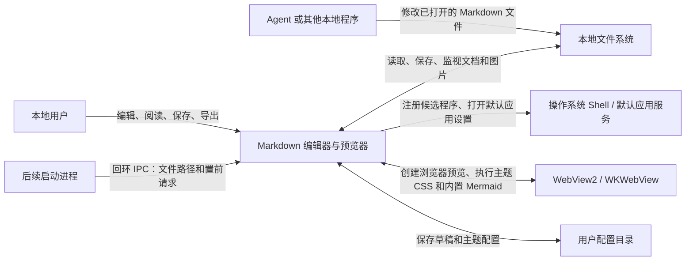
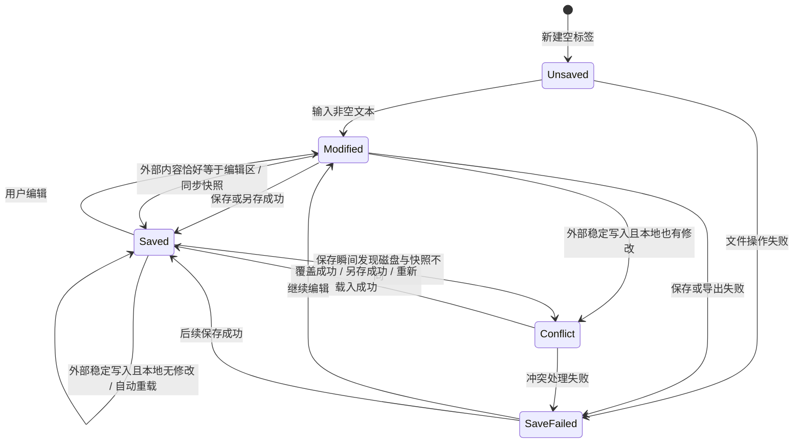
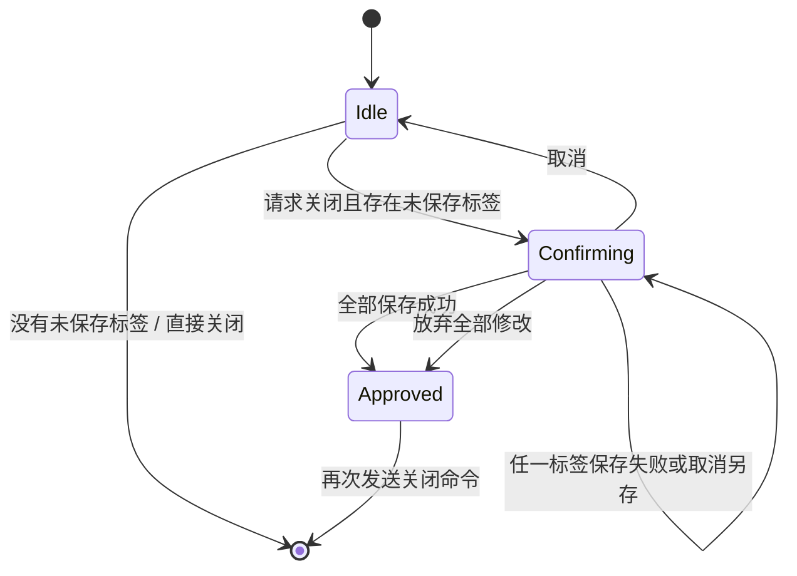
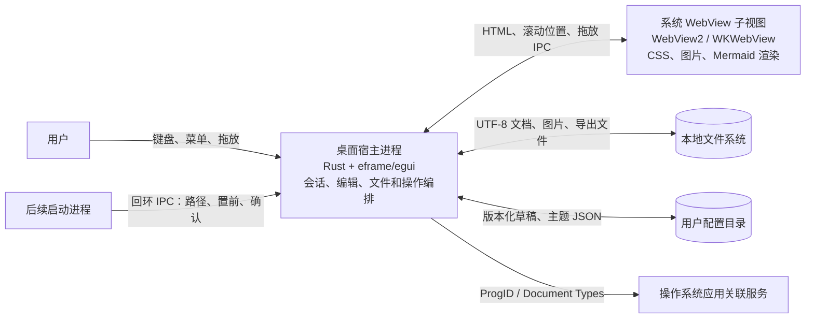
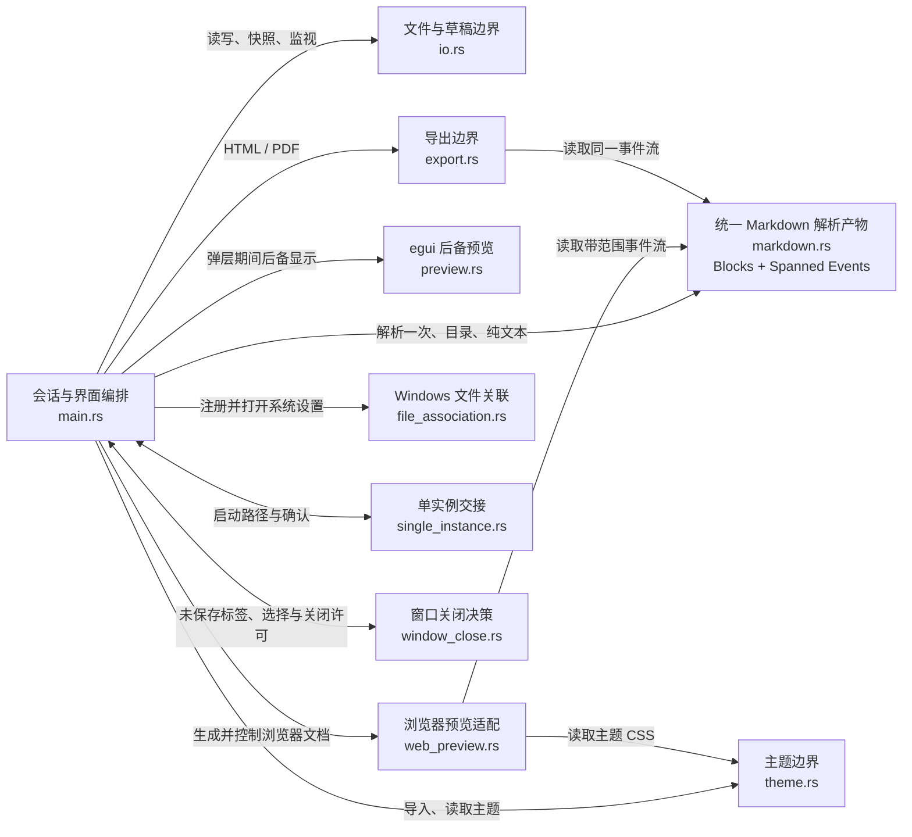

# Markdown 编辑器与预览器：系统设计说明

> 文档状态：当前实现基线
> 对应版本：v0.1.16
> 更新日期：2026-08-13
> 事实来源：`src/`、`Cargo.toml`、安装脚本、macOS App 配置、自动化测试和 GitHub Release

## 记录目的

这份文档用于支持后续功能设计、故障排查和架构决策。它写清系统服务谁、处理哪些数据、怎样改变状态、各模块负责什么、故障时保留什么，以及当前实现留下了哪些限制。

代码和测试负责证明规则已经实现。文档与代码不一致时，先把差异记录为问题，再决定修改实现或修改设计。

## 设计摘要

| 问题 | 当前答案 |
| --- | --- |
| 系统解决什么问题 | 在一个本地桌面应用中完成 Markdown 写作、浏览器级预览、文件管理、主题检查和导出 |
| 主要用户 | 在 Windows 或 macOS 上维护本地 Markdown 文件的个人用户；也包括通过 Agent 修改同一文件的用户 |
| 文档事实源 | 编辑会话中的 UTF-8 `text`；绑定文件后用 `disk_snapshot` 判断磁盘是否变化 |
| 主要运行单元 | Rust/egui 桌面进程和系统 WebView 子视图 |
| 主要数据存储 | 用户选择的本地文件；用户配置目录中的版本化草稿和主题配置 |
| 核心安全规则 | 读取完整成功后才替换文本；外部冲突未解决前不覆盖磁盘；主题和 Markdown 不能执行任意脚本 |
| 当前发布形态 | Windows Setup、Windows 免安装 ZIP、macOS Intel/Apple Silicon Universal App ZIP |

## 1. 问题与系统边界

### 1.1 用户目标

用户需要完成下面的闭环：

1. 打开、新建或拖入一个或多个 Markdown 文档；
2. 在写作、阅读、分栏和专注模式之间切换；
3. 用系统浏览器引擎检查 Markdown、主题 CSS、本地图片和 Mermaid 图表；
4. 在长文档中按章节目录定位，并让分栏两侧按源码位置同步滚动；
5. 保存文件；Agent 或其他程序修改磁盘文件后，自动采用新内容或提示冲突；
6. 导出 HTML、PDF，或复制纯文本和 HTML；
7. 在操作系统中把应用登记为 `.md`、`.markdown` 的候选默认应用。

### 1.2 当前范围

已实现：

- 单窗口多标签；每个标签独立保存文本、路径、磁盘快照、解析结果、状态、提示和滚动位置；
- 文件选择器多选、命令行路径、文件拖放和默认应用启动路径；后续启动请求复用现有窗口；
- CommonMark、表格、脚注、删除线、任务列表、代码围栏和 Mermaid；
- Windows WebView2 与 macOS WKWebView 实时预览；
- 阅读目录、章节定位和分栏双向滚动同步；
- `.css`、主题 `.json` 和含 CSS/JSON 的 `.zip` 主题包；
- 内置少数派经典 CSS；代码块语言标签；本地相对图片；
- JetBrains Mono 英文字体和霞鹜文楷中文回退字体；
- 12–22 px 正文字号设置，编辑区和浏览器预览共用同一字号；
- 保存冲突检查、外部文件自动重载、多标签版本化草稿恢复；
- HTML/PDF 导出、纯文本复制和 HTML 复制；
- Windows 注册表候选应用登记和默认应用设置入口；
- macOS App 的 Markdown 文档类型声明；
- Windows 与 macOS 应用图标和发布包。

当前不包含：

- 多人协作、云同步、评论、版本历史和插件运行时；
- 所见即所得编辑；编辑区始终保存 Markdown 源码；
- 非 UTF-8 编码转换；
- 结构化日志、性能指标和分布式追踪。

### 1.3 输入、输出与约束

| 类别 | 内容 | 边界规则 |
| --- | --- | --- |
| 用户操作 | 键盘、粘贴、菜单、快捷键、标签切换、拖放 | 编辑器是文档内容的唯一人工修改入口 |
| 文档输入 | `.md`、`.markdown`、`.txt` 文件 | 文件读取上限 10 MiB；只接受有效 UTF-8；开头 BOM 会被移除 |
| 启动请求 | 后续进程传入的一个或多个文件路径 | 每用户只保留一个主进程；本机回环 IPC 上限 1 MiB；主进程继续执行文件类型、存在性和重复标签检查 |
| 外部写入 | Agent 或其他程序修改已打开文件 | 每 350 ms 检查一次；检测到变化后等待至少 450 ms 稳定期 |
| 主题输入 | `.css`、主题 `.json`、`.zip` | ZIP 候选条目上限 2 MiB；只在内存中读取，不解压到用户目录 |
| 图片输入 | Markdown 图片或原生 HTML `` 中的绝对、相对本地路径 | 预览统一改写为本地资源协议；HTML/PDF 导出统一内嵌；支持 PNG、JPEG、GIF、WebP、BMP、SVG |
| 文档输出 | Markdown、主题化 HTML、主题化 PDF、剪贴板 | HTML/PDF 接收活动主题和字号；输出失败时保留编辑区内容和当前预览 |
| 应用配置 | 多标签草稿会话、已导入主题 | 写入用户配置目录；携带格式版本，损坏时隔离并降级；草稿会话上限 256 MiB |
| 平台依赖 | Windows 10/11、WebView2；macOS 11+、WKWebView | 字体和 Mermaid 随应用内置；普通预览不依赖网络 |

### 1.4 系统上下文



图的中心范围只包含 Markdown 编辑器应用。操作系统、WebView 运行时、文件系统和外部 Agent 都是直接交互的外部对象。

## 2. 数据、状态与关系

### 2.1 文档标签

`MdEditorApp.tabs` 保存全部标签，`active_tab` 指向当前标签。界面、保存、预览、导出和外部重载都直接读写 `tabs[active_tab]`；应用不再保存活动文档镜像，也不存在切换前的手动写回路径。

| 数据 | 含义 | 规则 |
| --- | --- | --- |
| `id` | 标签稳定标识 | 单调递增；文件同名时仍保持唯一 |
| `text` | 当前 UTF-8 文本 | 编辑、复制、导出和预览都以它为输入 |
| `path` | 绑定文件路径 | 空值表示未命名文档 |
| `disk_snapshot` | 最近一次成功打开或保存得到的原始字节 | 保存和外部重载用它判断变化与冲突 |
| `status` | `Unsaved / Saved / Modified / Conflict / SaveFailed` | 供关闭确认、状态栏和故障处理使用 |
| `document` | `ParsedDocument` | 保存对应源码、规范化文本、内部块模型和带源码范围的事件流；所有 Markdown 消费者共享 |
| `conflict` | 待处理的冲突路径 | 用户选择覆盖、另存或重新载入前保留 |
| 交互状态 | 提示、草稿时间、编辑时间、两侧滚动位置、光标行 | 标签切换后恢复当前文档的界面上下文 |

### 2.2 外部文件观察

外部观察数据按路径保存：

```text
FileStamp = {
  modified: Option<SystemTime>,
  len: u64
}

PendingExternalChange = {
  stamp: FileStamp,
  bytes: Vec<u8>,
  first_seen: f64
}
```

`FileStamp` 用修改时间和长度判断文件是否可能变化。候选变化先读取完整字节，再等待文件戳保持稳定。稳定后才进入文本替换或冲突判断。

### 2.3 Markdown、主题与浏览器状态

Markdown 只有一个解析入口，决策见 [ADR-0002](docs/adr/0002-single-markdown-parse-product.md)。`ParsedDocument` 同时保存内部块模型和带源码范围的 `pulldown-cmark` 事件流。列表项和引用继续包含块；强调、加粗、链接和图片继续包含行内内容；表格包含行、单元格和行内内容。浏览器预览与导出直接消费这份事件流，不再从源码创建第二个解析器。

`ThemePackage` 保存主题名称、作者、原始 CSS、亮暗色色板和排版参数。浏览器 CSS 顺序固定为：

1. 表格等结构的最低后备样式；
2. 用户导入或内置的原始主题 CSS；
3. 字体、代码语言标签、列表缩进、Mermaid、滚动条和用户字号兼容层。

`BrowserPreview` 保存 WebView 句柄、当前文档引用、物理边界、显示状态、菜单快照，以及源码位置和拖放路径的跨线程桥接数据。HTML 通过 `mdpreview` 内部协议交给 WebView，避免大文档超过字符串导航通道的限制。超过 512 KiB 的预览按约 96 KiB 的顶层块边界虚拟化：首屏加载一个块，视口附近按需加载，远端块以估算高度占位并可回收。Markdown 节点仍作为 `body` 的直接子节点插入，主题的父子选择器不会因分块而改变。离开阅读或分栏模式时释放 WebView，减少后台浏览器进程占用。

### 2.4 文档状态机



`Saved` 表示内存文本与应用保存的磁盘快照一致。它不承诺文件此后不会被其他程序修改。

### 2.5 窗口关闭状态机

`CloseGuard` 只允许三种互斥状态：`Idle` 表示没有整窗关闭请求；`Confirming` 保存本次请求的唯一 ID、首次捕获的未保存标签清单和可选失败标签；`Approved` 表示用户已经成功保存全部标签或明确放弃全部修改，下一次关闭请求可以通过。



保存结果和放弃选择只有在 `Confirming` 状态才有效，保存结果携带的请求 ID 必须与当前确认一致。迟到、重复或来自旧确认窗口的结果不能把 `Idle` 或新的 `Confirming` 状态提升为 `Approved`；确认已经显示时重复收到关闭请求，也不能替换首次清单或清除失败标记。

### 2.6 不变量

每项操作结束后必须满足：

1. `text` 保存用户当前看到的源码；读取完整成功前不替换它；
2. 本地和外部内容同时变化时保留本地文本，并进入 `Conflict`；
3. 保存、导出、主题导入和默认应用注册失败时不清空文档；
4. `document.source() == text` 时，内部块模型、浏览器事件和源码范围必须由同一次解析生成；
5. 切换标签只改变 `active_tab`；编辑、状态栏、目录、复制、导出和预览直接读写目标 `DocumentTab`；
6. 重复打开同一路径时切换到已有标签，不创建第二份内存副本；
7. 关闭有修改或冲突的标签前必须取得保存、放弃或取消选择；
8. 关闭最后一个标签后立即创建空标签；
9. 主题导入失败时保留原主题和字号；
10. 恢复草稿逐项重建标签且只修改内存；若磁盘偏离草稿保存时的基线，则进入 `Conflict`，用户确认前不改变原文件；
11. WebView 只允许内置字体、固定 Mermaid 脚本和受支持的本地图片协议；Markdown 和主题不能注入脚本；
12. 菜单和模态窗口必须显示在预览上方；弹层关闭后恢复当前文档的浏览器预览；
13. 整窗关闭确认必须列出请求发生时的全部未保存标签，不能只检查活动标签；
14. 任一标签保存失败或取消另存时保持 `Confirming`，激活失败标签且不清理草稿；
15. 只有全部保存成功或用户明确放弃全部修改后才能进入 `Approved` 并清理当前窗口草稿。

## 3. 关键操作与状态变化

### 3.1 打开文档

文档可以来自文件选择器、启动命令行、操作系统文件关联或拖放。拖放到 egui 区域和原生 WebView 区域走不同事件入口，最后合并到 `open_path`。

处理顺序：

1. 拖放入口只接受现存文件和 `.md`、`.markdown`、`.txt` 扩展名；
2. `open_path` 先检查路径是否已经存在于标签集合；
3. 新路径先读取元数据并检查 10 MiB 上限；
4. 完整读取字节，验证 UTF-8，去掉开头 BOM；
5. 全部成功后创建 `DocumentTab`，保存原始字节快照并切换到新标签；
6. 失败时显示超限、编码或 I/O 错误，原标签内容不变。

文件对话框和拖放会按扩展名筛选。命令行内部入口仍以大小和编码检查作为最终读取边界。

### 3.2 编辑到预览

1. 界面帧比较 `text` 和 `document.source()`；
2. 文本变化时调用唯一入口 `parse_document`，一次生成内部块模型和带范围事件流；
3. 阅读或分栏模式根据标签、文档版本、主题、文档目录和字号查找 HTML 缓存；缓存失效时生成完整语义 HTML，大文档再拆成浏览器虚拟块；
4. 每个顶层块插入源码行锚点，每个标题生成稳定且唯一的章节锚点；
5. 本地图片路径改写为 `mdfile` 自定义协议；
6. 文档含 Mermaid 围栏时才加载内置 Mermaid 运行库；
7. HTML 引用变化时更新 `mdpreview` 响应并导航到带版本号的内部 URL；引用不变时保留现有页面；
8. 虚拟预览按源码范围完成双向滚动，目录跳转先加载包含目标标题的块；Mermaid 在块进入 DOM 后渲染；
9. WebView 失败时显示错误，编辑和文件操作继续可用。

当前实现对每次文本变化执行一次全量语义解析，并在预览可见时生成一次完整 HTML。事件流保存在活动标签中，浏览器预览和导出不再重复解析；未变化的 HTML 不再逐帧生成或哈希。长文档基准和容量预算见 [ADR-0003](docs/adr/0003-long-document-performance-budget.md)。

### 3.3 外部修改自动加载

系统默认监视所有已绑定路径的标签。用户可以在“视图”菜单关闭“自动加载外部修改”。

| 磁盘内容 | 编辑区内容 | 处理结果 |
| --- | --- | --- |
| 等于原快照 | 任意 | 不处理 |
| 不等于原快照 | 等于磁盘新内容 | 更新快照，标记 `Saved` |
| 不等于原快照 | 本地没有修改 | 采用磁盘新内容，重新解析并保持 `Saved` |
| 不等于原快照 | 本地已有修改 | 保留本地文本，标记 `Conflict` |
| 文件缺失、超限或编码无效 | 任意 | 保留文本，在对应标签记录监视错误 |

稳定等待避免读取 Agent 正在分段写入的文件。当前变化检测依赖修改时间和长度；文件系统在同一时间精度内写入相同长度的新内容时，可能漏掉变化。

### 3.4 保存与冲突处理

普通保存先读取当前磁盘字节并与 `disk_snapshot` 比较：

| 前置条件 | 动作 | 结果 |
| --- | --- | --- |
| 已绑定路径，磁盘等于快照 | 写入 `text` | 更新快照，进入 `Saved` |
| 已绑定路径，磁盘不同于快照 | 拒绝写入 | 进入 `Conflict`，显示处理窗口 |
| 未绑定路径 | 选择目标并直接创建或覆盖 | 成功后绑定路径并进入 `Saved` |
| 冲突中选择覆盖 | 跳过快照比较并写入 | 成功后进入 `Saved` |
| 冲突中选择另存 | 写入新路径 | 成功后绑定新路径并进入 `Saved` |
| 冲突中选择重新载入 | 完整读取磁盘文件 | 替换内存文本和快照，进入 `Saved` |

取消另存或写入失败会保留编辑内容。冲突处理窗口被关闭前，普通保存不能静默覆盖外部内容。

### 3.5 标签创建、切换与关闭

- 新建标签产生空文本、空路径和 `Unsaved` 状态；
- 一次文件选择或拖放可以打开多个标签；
- 标签切换保存原标签全部会话状态，再载入目标标签；
- 未修改标签直接关闭；修改或冲突标签显示“保存并关闭、放弃修改、取消”；
- 标签过多时顶部区域横向滚动并隐藏滚动条；
- 所有标签共享一个 WebView 实例，切换后加载当前标签的浏览器文档。

应用启动时先按用户配置目录计算稳定的本机回环端口。首个进程绑定端口并成为主进程；文件关联、命令行或再次双击应用产生的后续进程把全部路径和窗口置前请求发送给主进程，收到确认后立即退出。主进程在界面循环中接收请求：有效的新路径创建标签，已经打开的路径只切换标签，空路径只负责恢复并置前现有窗口。性能基准显式绕过单实例通道，避免被日常运行的窗口接管。

### 3.6 长文档定位与分栏同步

阅读模式从内部块模型提取 H1–H6，保留标题层级。点击目录后，WebView 按章节索引平滑滚动到对应标题。目录跳转开始前必须取消仍在运行的源码位置同步动画，并使打开页面时排队等待的旧位置恢复任务失效，保证同一时刻只有一个有效滚动控制者，避免旧目标把页面继续推到后一章。普通预览必须使用完整真实块高度，不能用 `content-visibility` 的离屏估算参与标题坐标计算；长文档的容量控制由虚拟块负责。目标标题如果仍在虚拟块中，目录跳转必须等待该块进入 DOM；若视口维护已经在加载同一个块，两条路径共享并等待同一个加载任务，不能把“正在加载”误判成“已经加载”。因此一次点击就必须到达目标章节，不允许依赖第二次点击补偿。

分栏模式通过源码位置同步两侧：

1. 浏览器文档在顶层 Markdown 块前写入源码行锚点；
2. 编辑区滚动位置转换成“行号 + 行内比例”；
3. 浏览器在相邻源码锚点之间插值，得到目标页面位置；
4. 用户滚动浏览器时，JavaScript 把当前源码位置通过 IPC 传回桌面进程；
5. 只有用户发起的浏览器滚动可以反向驱动编辑器；页面重载和程序滚动事件会被抑制，避免两侧互相拉扯。

### 3.7 主题、本地资源和 Mermaid

主题文件在 `theme.rs` 边界内转换为 `ThemePackage`：

1. CSS 文件保留原始 CSS，并提取应用外壳需要的颜色和排版参数；
2. JSON 文件解析为完整主题数据；
3. ZIP 按条目顺序查找有效 JSON；没有有效 JSON 时采用第一个 CSS；
4. 导入成功后写入用户配置目录中的版本化配置，刷新应用外壳和浏览器预览；
5. 导入失败时保留当前主题。

主题 CSS 在浏览器中原样执行。兼容层只处理字体、字号、Markdown DOM 差异、代码标签、列表缩进、Mermaid 和隐藏滚动条。新增兼容覆盖时必须写明选择器、理由和回归测试。

### 3.8 草稿、导出与默认应用

草稿保存条件为：至少一个标签有未保存内容、所有待保存标签停止输入超过 30 秒，并且至少一个标签距离上次草稿写入超过 30 秒。未命名空标签不保存；绑定路径的文档即使被清空也必须保存，以免丢失“删除全部正文”这一修改。草稿写入用户配置目录的 `state/draft.json`，格式版本为 2，包含会话保存时间、活动标签 ID，以及每个未保存标签的 ID、原路径、正文、磁盘基线和独立保存时间；总文件上限 256 MiB，超过 30 天自动清理。版本 1 的单份草稿和旧临时目录纯文本草稿会迁移为单标签会话。

启动时发现有效草稿会显示待恢复标签数量。用户确认后逐项重建标签并恢复原活动标签：原文件未变化时恢复为 `Modified`；磁盘已经等于草稿正文时协调为 `Saved`；磁盘与保存基线均不同时保留草稿正文并进入 `Conflict`；原文件缺失或暂时不可读时仍保留标签、路径和正文，要求用户另存或修复文件。

关闭整个窗口时，应用汇总全部未保存标签并显示一次确认。用户可以“全部保存并关闭”“放弃全部修改”或“取消”；全部保存按标签逐项执行，任一标签保存失败或取消另存时立即停止关闭、激活失败标签并保留确认窗口。只有全部保存成功或明确放弃后才清理当前窗口草稿并退出。

主题写入用户配置目录的 `themes/current.json`，包含格式版本、保存时间和主题包。草稿或主题为空、超限、版本不兼容、时间异常或 JSON 损坏时，文件改名为 `.corrupt-时间戳` 并降级为无草稿或内置主题；隔离文件、临时文件和备份文件保留 7 天后清理。旧版本位于系统临时目录的草稿和主题会在首次读取时迁移，迁移成功后删除旧文件。

HTML 和 PDF 采用主题一致导出，决策见 [ADR-0001](docs/adr/0001-theme-consistent-export.md)。`main.rs` 把活动标签的主题 CSS、正文字号、文档目录和标题传给 `export.rs`。导出模块使用相同的 Markdown 解析选项、DOM 兼容规则和应用字体生成完整文档。

HTML 内嵌字体、本地图片和按需 Mermaid 运行库，离开应用后仍可显示。PDF 把同一主题化 DOM、字体和本地图片交给 `printpdf`，并直接写入用户选择的路径。PDF 引擎不执行 JavaScript，因此 Mermaid 在 PDF 中保留为代码块；浏览器专有 CSS 超出 `printpdf` 能力时允许局部退化。

Windows 默认应用处理顺序：

1. Setup 在当前用户注册表写入 ProgID、Open With 和 `RegisteredApplications` 能力；
2. 免安装版通过“文件 → 设为 Markdown 默认应用…”按当前 exe 路径写入同一组能力；
3. 应用通知 Explorer 关联信息变化；
4. 应用打开 Windows 默认应用设置；
5. 用户确认 `.md` 和 `.markdown` 的默认程序。

Windows 8 及以后由用户完成最终默认选择，应用不修改受保护的 `UserChoice`。macOS App 通过 `CFBundleDocumentTypes` 声明 `md` 和 `markdown` 的 Editor 角色，用户可在 Finder“显示简介 → 打开方式”中选择应用。

## 4. 模块、接口与变化边界

### 4.1 模块职责

| 模块 | 拥有的知识 | 主要接口 | 变化应留在这里 |
| --- | --- | --- | --- |
| `main.rs` | 会话、标签、状态转移、布局、快捷键、外部观察编排 | `open_path`、`save`、`poll_external_changes`、`App::ui` | 新交互、新状态、新操作流程 |
| `window_close.rs` | 整窗关闭确认、未保存标签清单和关闭许可 | `CloseGuard::request_close`、`finish_save_all`、`discard_all` | 多标签关闭决策和保存失败处理 |
| `html_image.rs` | 原生 HTML `img` 标签扫描、`src` 属性提取和安全替换 | `rewrite_sources` | 原生 HTML 图片属性兼容规则 |
| `io.rs` | 文件上限、UTF-8、快照、冲突写入、草稿路径 | `read_markdown`、`file_stamp`、`save_with_conflict_check` | 编码、原子写入、冲突和草稿策略 |
| `storage.rs` | 用户配置目录、版本号、原子替换、损坏隔离和过期清理 | `config_dir`、`write_atomic`、`quarantine_corrupt`、`cleanup_sidecars` | 持久化位置、版本迁移和清理策略 |
| `markdown.rs` | 唯一 Markdown 解析入口、兼容预处理、内部块/行内模型、带范围事件流和纯文本提取 | `parse_document`、`ParsedDocument`、`plain_text` | 语法和统一解析产物 |
| `web_preview.rs` | 浏览器 HTML、CSS 层叠、自定义协议、Mermaid、源码锚点、WebView 生命周期 | `document`、`BrowserPreview::show`、滚动与章节接口 | 浏览器 DOM、资源、安全和滚动同步 |
| `preview.rs` | egui 后备预览 | `show_preview_with_theme` | 无 WebView 或弹层期间的后备显示 |
| `theme.rs` | 主题格式、ZIP 选择、主题持久化和应用色板 | `ThemePackage::from_file`、`spec`、`browser_css` | 外部主题格式和兼容参数 |
| `export.rs` | 主题化 HTML/PDF、导出资源和内置字体 | `ExportOptions`、`render_styled_html`、`export_html`、`export_pdf` | 导出格式、资源内嵌和 PDF 兼容 |
| `file_association.rs` | Windows ProgID、注册表能力和系统设置入口 | `register_and_open_default_apps` | Windows 默认应用协议 |
| `single_instance.rs` | 每用户回环地址、启动请求协议、监听、转发和确认 | `acquire`、`OpenRequest` | 单实例边界、协议版本、消息上限和进程间交接 |
| `installer/`、`packaging/macos/` | 安装注册、图标、App Bundle 文档类型 | Inno Setup、`Info.plist` | 发布包与平台集成 |

### 4.2 关键接口契约

| 接口 | 输入 | 成功结果 | 失败结果 | 未承诺内容 |
| --- | --- | --- | --- | --- |
| `read_markdown(path)` | 本地路径 | 去 BOM 的 UTF-8 文本 | 超限、非 UTF-8、I/O 错误 | 缓冲方式和读取次数 |
| `save_with_conflict_check(path,text,snapshot)` | 路径、文本、原快照 | 新磁盘快照 | 外部修改或 I/O 错误 | 未来是否改用哈希、锁或原子替换 |
| `parse_document(markdown)` | 任意 UTF-8 文本 | 同源的内部块模型和带范围事件流 | 当前为总函数 | 解析栈和兼容预处理细节 |
| `document(parsed,css,base,size)` | 统一解析产物、主题、目录、字号 | 完整浏览器 HTML | 当前为总函数 | DOM 注解和哈希实现 |
| `BrowserPreview::show(...)` | 父窗口、区域和 HTML | 可见 WebView | 创建、定位或加载错误 | WebView 原生句柄 |
| `ThemePackage::from_file(path)` | CSS、JSON 或 ZIP | 统一主题包 | 格式、编码、大小和字段错误 | ZIP 原始目录结构 |
| `export_html(path,markdown,options)` | 文本、活动主题、字号、目录和标题 | 自包含主题化 HTML | 文件写入错误 | 输出体积和浏览器实现细节 |
| `export_pdf(path,markdown,options)` | 文本、活动主题、字号、目录和标题 | 使用相同主题输入的 PDF | HTML/CSS 转换或文件写入错误 | JavaScript 执行和浏览器专有 CSS |
| `register_and_open_default_apps()` | 当前 exe 路径 | 候选程序注册完成并打开设置 | 注册表或进程启动错误 | Windows 最终用户选择 |
| `single_instance::acquire(paths)` | 启动参数中的全部文件路径 | 主进程获得接收器；后续进程收到确认并退出 | 端口被无关程序占用或现有进程无响应时显示错误并退出 | 跨设备、跨用户或网络通信 |

### 4.3 变更影响

| 变化 | 首要修改位置 | 必须同时检查 |
| --- | --- | --- |
| 新 Markdown 语法 | `markdown.rs` | ADR-0002 结构对照、浏览器、导出、目录和纯文本测试 |
| 新主题格式 | `theme.rs` | 浏览器 CSS、应用色板、持久化兼容 |
| 新本地资源类型 | `web_preview.rs` 自定义协议 | MIME、路径安全和 CSP |
| 新文档状态 | `main.rs` | 关闭确认、状态栏、草稿、保存和外部重载 |
| 新平台 | 平台包装和条件编译 | WebView、默认应用、图标、快捷键和发布流水线 |
| 导出主题或资源规则 | `export.rs` | ADR-0001、本地图片、字体、Mermaid 和 PDF 能力 |
| 多文档可靠恢复 | `io.rs` 与会话模型 | 标签标识、路径、时间、版本迁移和清理策略 |

## 5. 质量要求、故障边界与恢复

### 5.1 可判断的质量场景

| 编号 | 触发与环境 | 系统响应 | 判断标准 | 当前证据 |
| --- | --- | --- | --- | --- |
| Q1 | 打开不超过 10 MiB 的有效 UTF-8 文件 | 完整读取后创建或切换标签 | 读取失败不替换原文本 | 大小、编码和打开逻辑测试 |
| Q2 | 打开超过 10 MiB 的文件 | 拒绝读取并报告实际大小与上限 | 原标签内容保持不变 | 单元测试 |
| Q3 | Agent 修改已打开文件，本地无修改 | 等待文件稳定后自动采用新内容 | 轮询 350 ms；稳定等待至少 450 ms；状态保持 `Saved` | 外部重载单元测试 |
| Q4 | Agent 和用户同时修改同一文件 | 保留本地文本并进入冲突 | 磁盘内容不被自动覆盖 | 冲突与外部修改测试 |
| Q5 | 用户在分栏任一侧滚动长文档 | 另一侧按源码位置连续跟随 | 物理滚动变化超过 0.5 px 即允许同步 | 源码位置转换和阈值测试 |
| Q6 | 普通文档不含 Mermaid | 不加载 Mermaid 运行库 | HTML 中没有 Mermaid 脚本 | 浏览器文档测试 |
| Q7 | 应用离线运行 | 内置字体、主题和 Mermaid 可用 | 不请求网络资源也能完成内置渲染 | 自定义协议与资源测试 |
| Q8 | 菜单或模态窗口覆盖阅读区 | 弹层保持可见，正文位置仍有后备画面 | 弹层关闭后恢复实时 WebView | 冻结快照与关闭策略；需持续做界面回归 |
| Q9 | 安装或免安装版登记默认应用 | 系统设置能列出 Markdown Editor | `.md`、`.markdown` 均指向应用 ProgID | 注册命令测试和 Setup 编译验证 |
| Q10 | 当前主题、字号和本地图片发生变化后导出 | HTML/PDF 使用活动预览状态 | HTML 含主题、字号、字体和内嵌图片；PDF 可成功生成 | 主题化 HTML 和 PDF 单元测试；ADR-0001 |
| Q11 | 同一输入包含标题、列表、表格、代码、图片、链接和加粗 | 内部模型与 HTML 事件保持同构 | 结构计数完全一致；浏览器标签数量匹配事件流 | ADR-0002 结构对照测试 |
| Q12 | 100 KiB、1 MiB、10 MiB 文档进入解析、HTML 和 WebView | 记录分层耗时及完整进程树内存 | 三档预算全部通过；10 MiB WebView ≤5 s 且峰值工作集 ≤2 GiB | ADR-0003；本机实测 4.13 s、1.27 GiB |
| Q13 | 已有窗口运行时，通过文件关联再次打开一个或多个文件 | 后续进程把路径发给主进程后退出；主窗口置前并创建或切换标签 | IPC 收到确认；相同路径不重复建标签；Unicode 路径保持不变 | 协议往返、真实 TCP 转发和标签应用测试 |
| Q14 | 文档使用原生 HTML `` | 预览读取相对本地图片，数值型 `width` 覆盖主题的通用图片宽度且不超出内容区，导出内嵌同一图片 | `src` 被改写；`alt`、`width` 等属性保持不变；已有内联 `width` 优先；外部 URL 不改写 | 原始 HTML 预览、导出、CSS 级联和属性扫描测试 |
| Q15 | 长文档目录目标块正在由视口维护加载时点击目标章节 | 第一次点击等待现有加载任务并定位到目标标题 | 同一块只保留一个进行中的加载任务；标题进入 DOM 后再调用定位 | 虚拟块并发加载回归测试；长文档手工定位 |
| Q16 | 源码位置同步动画尚未结束时点击阅读目录 | 立即取消旧动画并平滑定位到所点章节，不越过到后一章 | 目录跳转成为唯一滚动控制者；取消发生在目标滚动之前 | 无头 Edge 竞态复现；滚动入口顺序单元测试 |
| Q17 | 页面刚打开、旧阅读位置仍在等待字体就绪或浏览器空闲时点击目录 | 目录点击使排队中的旧位置恢复失效，最终停在所点章节 | 每次显式导航递增版本；恢复任务只在版本未变化时执行 | 无头 Edge 延迟恢复竞态复现；导航版本单元测试 |
| Q18 | 普通预览首次从文档顶部跳到远端章节 | 使用真实布局高度把目标标题顶部放到视口顶部，不因离屏块展开而漂移 | 普通预览不启用近似块高度；大文档继续由虚拟块控制 DOM 容量 | 真实 Markdown 无头 Edge 坐标测试；兼容 CSS 单元测试 |
| Q19 | 关闭含一个或多个未保存标签的窗口 | 显示一次汇总确认，并允许全部保存、全部放弃或取消 | 任一保存失败或取消另存都保持窗口和草稿；重复关闭不覆盖确认；旧请求结果不能批准新请求；全部成功或明确放弃才退出 | `CloseGuard` 请求 ID 与状态转换测试；多标签真实文件保存与失败停止测试 |

### 5.2 故障处理

| 故障 | 用户看到什么 | 隔离范围 | 恢复方式 | 当前观察信息 |
| --- | --- | --- | --- | --- |
| 文件缺失、无权限 | 状态栏显示 I/O 错误 | 当前路径 | 恢复文件、授权或另存 | 路径和 OS 错误文本 |
| 文件超限 | 显示实际大小和 10 MiB 上限 | 本次打开或监视 | 缩小文件后重试 | 大小与限制值 |
| 非 UTF-8 | 显示编码无法识别 | 本次打开或外部重载 | 转换编码后重新写入 | 路径和编码错误 |
| 外部写入冲突 | 状态栏和冲突窗口 | 单个标签 | 覆盖、另存或重新载入 | 冲突路径和用户选择 |
| WebView 创建或加载失败 | 状态提示，阅读区无法使用浏览器渲染 | 当前预览 | 编辑、保存和后备预览继续可用；修复运行时后重试 | WebView 错误文本 |
| Mermaid 语法错误 | 保留源码并显示局部错误 | 单个图表 | 修改围栏内容后自动重绘 | Mermaid 错误消息 |
| 主题无效 | 显示导入错误 | 本次主题切换 | 保留原主题 | 文件类型和解析错误 |
| 本地图片不可读或格式不支持 | 浏览器显示缺图 | 单张图片 | 修复路径、权限或格式 | 当前只有 404，无结构化日志 |
| 导出失败 | 状态栏显示错误 | 本次输出 | 更换路径或修复权限后重试 | 输出路径和底层错误 |
| 默认应用注册失败 | 状态栏显示注册或启动错误 | 平台集成 | 使用系统“打开方式”手动选择 | Windows 错误码或进程错误 |
| 单实例交接失败 | 启动进程显示无法连接现有窗口的错误 | 本次启动请求 | 关闭占用端口的异常程序或现有实例后重试 | 每用户端口、连接错误和监听错误 |
| 进程异常结束 | 下次启动提示一个或多个草稿标签 | 全部未保存非空标签 | 逐项恢复；磁盘变化的标签进入冲突处理 | 标签 ID、路径、正文、磁盘基线、保存时间和活动标签 |
| 整窗批量保存失败或取消另存 | 确认窗口保留并标出“保存失败”，状态栏说明窗口保持打开 | 失败标签及后续尚未保存标签 | 激活失败标签；修复路径或权限后再次全部保存，也可选择放弃或取消关闭 | 失败标签 ID、标签标题、底层保存状态和回归测试 |

### 5.3 恢复后的检查

1. 外部自动重载后，`text`、`disk_snapshot` 和磁盘内容一致；
2. 冲突覆盖成功后，重新读取磁盘应得到新快照；
3. 冲突重新载入后，本地未保存内容被明确放弃，状态回到 `Saved`；
4. 多标签草稿恢复后，标签数量、ID、路径、正文和活动标签一致，原文件保持不变；
5. WebView 重新创建后，加载当前标签的文本、主题、目录和字号；
6. 安装升级后，ProgID 命令指向当前安装目录；卸载后清理应用能力和 Open With 登记；
7. 整窗保存失败后，失败标签保持未保存、后续标签未被写入、确认窗口仍可继续操作且草稿仍然存在。

当前观察手段只有状态栏、错误窗口、测试输出和可复现输入。出现偶发的预览、外部重载、滚动或保存问题时，下一步应记录操作阶段、路径、输入规模、文件戳、耗时和底层错误。

## 6. 架构决策

| 决策 | 当前选择 | 得到的结果 | 接受的代价 | 重新评估条件 |
| --- | --- | --- | --- | --- |
| 桌面界面 | Rust + eframe/egui | 单一代码库、原生文件操作、无控制台窗口 | 复杂文本编辑能力有限 | 需要语法树编辑、插件或无障碍深度集成 |
| 预览引擎 | Wry 子 WebView | 浏览器忠实执行主题 CSS；复用系统运行时 | 原生层级、焦点、内存和生命周期处理复杂 | WebView 成为主要稳定性或资源问题 |
| Markdown 解析 | 单一 `ParsedDocument`，见 ADR-0002 | 一次解析同时提供内部模型、HTML 事件和源码范围 | 标签常驻事件流；内部模型仍要覆盖新语法 | 内存或全量解析基准不达标时 |
| 主题兼容 | 原始 CSS 后加载小型兼容层 | Typora/nvALT 风格主题可直接复用 | 少量属性会被应用规则覆盖 | 用户主题频繁出现不可接受差异 |
| 多文档 | 单窗口多标签，共享 WebView；界面直接操作活动 `DocumentTab` | 切换只改变活动索引；全部未保存标签进入同一草稿会话 | 草稿会话仍依赖用户确认恢复 | 需要多窗口、标签拖拽或跨窗口移动 |
| 外部修改 | 文件戳轮询 + 稳定等待 + 字节快照 | 无额外守护进程，能配合 Agent 写文件 | 轮询有延迟；相同时间戳和长度可能漏检 | 文件规模、标签数或漏检率上升 |
| 保存冲突 | 写入前比较完整原始字节 | 规则直接，不依赖时间精度 | 保存前多一次读取 | 文件上限提高或保存耗时超标 |
| 预览更新 | 全量解析、版本化缓存、内部协议和大文档虚拟块，见 ADR-0003 | 未变化页面零生成；大 HTML 不受字符串导航上限影响；10 MiB 首屏和内存达标 | 远端块首次加载前使用估算高度，加载后校正 | 固定性能机越过预算，或需要更严格的实时编辑承诺 |
| 本地持久化 | 用户配置目录、版本化 JSON、原子替换和损坏隔离 | 多标签草稿与主题不会被临时目录清理；支持旧数据迁移和安全降级 | 草稿总量限制 256 MiB；隔离文件最多保留 7 天 | 需要跨设备配置或会话同步时 |
| 默认应用 | 注册候选能力并打开系统设置 | 遵守 Windows 用户选择规则 | 需要用户确认，无法一键静默完成 | 改用 MSIX 或增加平台专用集成时 |
| 单实例 | 每用户稳定回环 TCP 端口、版本化 JSON 请求和确认字节 | 文件关联复用现有窗口；无需平台专用进程发现 API | 极小概率端口冲突；主进程界面循环最多约 350 ms 后消费请求 | 需要多窗口、用户可选多实例或沙箱平台限制回环通信时 |
| HTML/PDF 导出 | 主题一致导出，见 ADR-0001 | 主题、字号、字体和本地图片共享输入；继续直接保存 | PDF 浏览器专有 CSS 可能退化，Mermaid 不执行 | 需要 Mermaid 或浏览器像素级 PDF 时 |
| macOS 分发 | Universal App + ad-hoc 签名 | Intel 和 Apple Silicon 共用下载包 | 未公证，首次启动可能被 Gatekeeper 拦截 | 面向更多用户或进入正式分发渠道 |

## 7. C4 架构视图

### 7.1 容器视图



桌面宿主进程是主要应用容器。系统 WebView 是由平台浏览器运行时承载的子视图。文档目录属于用户内容；用户配置目录属于应用持久状态，使用版本、原子替换、损坏隔离和定期清理保护恢复能力。

### 7.2 桌面宿主组件视图



组件箭头表示调用和数据依赖。文件格式、主题格式、浏览器协议、导出格式和注册表协议分别留在自己的边界模块，界面只编排操作结果。

### 7.3 部署视图

| 平台 | 部署单元 | 外部运行时 | 安装与关联 |
| --- | --- | --- | --- |
| Windows 安装版 | `markdown-editor.exe`、许可证、图标、卸载器 | WebView2 Runtime | Inno Setup 写入当前用户 ProgID、Open With 和 RegisteredApplications |
| Windows 免安装版 | 单个 `markdown-editor.exe` | WebView2 Runtime | 用户从文件菜单登记当前路径；移动 exe 后需要重新登记 |
| macOS | `Markdown Editor.app` Universal Binary | WKWebView | `Info.plist` 声明 Markdown 文档类型；App 使用 ad-hoc 签名 |

## 8. 验证证据与已知缺口

### 8.1 当前验证

当前实现通过 124 项 Rust 测试，覆盖下面的规则：

- 文件大小、编码、BOM、保存冲突、新文件写入和草稿；
- Markdown 标题、列表、表格、代码边界、加粗和纯文本；
- 主题 CSS、ZIP/JSON 导入、字号、字体、脚注、Markdown 图片和原生 HTML 图片；
- Mermaid 按需加载、内置资源协议和 CSP；
- 阅读目录、标题锚点、源码锚点和滚动位置转换；
- 多标签修改标记、关闭规则、外部自动重载与冲突；
- 拖放扩展名、Windows 文件关联命令和单实例跨进程路径交接；
- HTML 和 PDF 导出。

2026-08-31 发布前复测：100 KiB、1 MiB、10 MiB 三档基准全部通过；10 MiB WebView 就绪 1.70 s，进程树峰值工作集 987 MiB，低于 5 s / 2 GiB 门槛。基准程序依赖已补齐，代码语言标注改为线性重建，脚本可直接执行。

最小回归命令：

```powershell
cargo test
cargo build --release
.\scripts\benchmark-long-docs.ps1 -EnforceBudgets
```

发布前还要执行：

1. 用 Inno Setup 编译安装版并实际安装、升级、卸载；
2. 验证 Windows“默认应用”能找到 Markdown Editor，并分别设置 `.md`、`.markdown`；
3. 保持窗口运行，再用文件对话框、拖放和双击关联文件打开多个文档，确认没有新增进程且路径成为标签；
4. 让外部进程连续写入已打开文件，分别验证自动重载、内容相同和本地冲突；
5. 在长文档中验证目录定位和两侧双向平滑同步；
6. 打开菜单和关闭确认窗口，检查 WebView 不遮挡弹层；
7. 建立多个未保存标签，分别验证全部保存成功、保存失败、取消另存、放弃全部和取消关闭；确认失败与取消时草稿文件保留，成功与放弃时当前窗口草稿清除；
8. 在 Intel 与 Apple Silicon macOS 上验证 App 启动、Finder 打开方式和文档打开事件；
9. 检查 GitHub Release 只包含 Windows Setup、Windows ZIP 和 macOS Universal App ZIP；
10. 在固定 Windows 性能机执行 ADR-0003 三档基准，保存 `latest.json` 并检查所有预算。

### 8.2 已知缺口

| 优先级 | 缺口 | 完成条件 |
| --- | --- | --- |
| P1 | 外部轮询可能漏掉相同时间戳、相同长度的改写 | 引入可靠文件通知或内容摘要，并增加模拟测试 |
| P1 | macOS Finder 文档事件缺少自动化验证 | 验证冷启动和应用已运行两种情况；必要时接入 `application:openURLs:` |
| P2 | 默认应用只登记 `.md` 和 `.markdown` | 产品确认后再决定是否把 `.txt` 作为候选，避免抢占通用文本类型 |
| P2 | 深色开关只保证应用外壳切换 | 定义主题深色契约，或把开关名称限定为“应用外观” |

## 9. 变更规则

修改功能时按影响更新设计：

1. 新目标、输入、输出或外部对象：更新第 1 节和系统上下文图；
2. 新数据、新状态或跨时间操作：更新第 2 节、状态机和不变量；
3. 新操作路径：更新第 3 节的开始条件、步骤、结果和失败处理；
4. 新文件格式、主题格式、协议或平台：在第 4 节指定唯一拥有者模块和接口契约；
5. 新故障或性能要求：更新第 5 节的触发、影响、响应、度量、隔离和恢复；
6. 两种以上方案都可行，或选择会长期影响多个模块：更新第 6 节的收益、代价和重新评估条件；
7. 运行单元、数据存储或组件依赖变化：更新第 7 节对应层级的 C4 图；
8. 发布前把正常、边界和失败示例转成自动化测试或明确的手工检查项；
9. 功能完成时，目标、数据、状态、接口、失败处理、恢复规则和验证证据必须同时存在。
