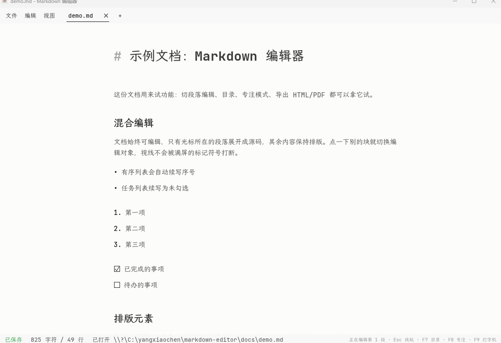

# Markdown 编辑器

用 Rust 和 egui 写的原生 Markdown 编辑器：**Typora 式段落级混合编辑**——文档始终可编辑，只有光标所在的段落展开成源码，其余内容保持排版。没有 WebView，启动快、可离线、长文档不卡。

[](https://github.com/idkwhatimdoing62/markdown-editor/releases)
[](https://github.com/idkwhatimdoing62/markdown-editor/actions/workflows/release.yml)

[](LICENSE)



> 上图就是编辑状态：标题正在被编辑（`#` 以弱化色显示、所见即源码），其余段落保持排版。示例文档见 [`docs/demo.md`](docs/demo.md)。

## 下载与安装

到 [Releases](https://github.com/idkwhatimdoing62/markdown-editor/releases) 下载：

| 平台 | 包 | 说明 |
| --- | --- | --- |
| Windows 10/11 | `markdown-editor-vX.Y.Z-windows-x86_64-setup.exe` | 安装版，可选关联 `.md` / `.markdown` |
| Windows 10/11 | `markdown-editor-vX.Y.Z-windows-x86_64.zip` | 免安装，解压即用 |
| macOS 11+ | `markdown-editor-vX.Y.Z-macos-universal.app.zip` | 通用版，同时支持 Apple Silicon 与 Intel |

macOS 包采用本地临时签名，首次运行若被 Gatekeeper 拦截：在 Finder 中右键应用选「打开」，或到「系统设置 → 隐私与安全性」里允许启动。

## 为什么用它

- **不是再做一个预览器**：段落级混合编辑，写作时看到的排版和最终导出的一致，不需要左右分屏对源码。
- **长文档不卡**：解析与全文搜索在后台 worker，界面每帧只读不可变快照；长文档按视口剔除，只布局可见区域附近约 1.5 个视口（2 MB 文档全帧渲染从约 135 ms 降到约 2 ms）。
- **原生且轻量**：egui 直接绘制，没有 WebView、没有运行时依赖，字体与 Mermaid 都随包内置。
- **界面安静**：一套固定视觉基准（4px 网格、4.5:1 对比度、70 字符行宽）并用测试钉住，换主题也不会跑偏。

## 主要功能

**编辑体验**

- 点一下段落即切换编辑对象，`Esc` 收起；当前段落保留 `#`、`-`、`1.`、`**` 等标记（弱化显示），所见即源码
- Enter 自动续写列表：有序列表递增序号、任务列表续写为未勾选、缩进保留；空列表项上再按 Enter 退出列表
- 专注模式（F8）置灰当前段落以外的内容，打字机模式（F9）让编辑段落保持在视口中央
- `Ctrl+鼠标滚轮` / `Ctrl+=` / `Ctrl+-` / `Ctrl+0` 缩放正文字号
- 内置「专注写作」主题：素净配色、无装饰色块，浅色与深色两套配色

**Markdown 支持**

- CommonMark、表格、脚注、任务列表、围栏代码块（右上角显示语言名、注释按语言弱化）
- 目录（F7）与段落编辑共用同一份解析结果，改标题即时同步
- Mermaid 图表：导出 HTML 时渲染成 SVG

**文件与集成**

- 多文件标签页、拖入文件打开、多窗口（`Ctrl+Shift+N`）
- 打开 / 保存 / 另存为、外部修改冲突检测（含 compare-and-swap 写入，不会悄悄覆盖别人改过的文件）、崩溃草稿恢复
- 导出 HTML / PDF，复制 HTML 或渲染内容；HTML 导出会把图片内嵌为 data URI，纯 ASCII 文档自动跳过中文字体（体积从约 36 MB 降到 1 MB 以内）
- 可注册为 `.md` / `.markdown` 的默认应用（Windows 安装版会出现在「默认应用」候选里，但不静默修改你的选择）

## 快捷键

| 功能 | Windows / Linux | macOS |
| --- | --- | --- |
| 打开 / 新建标签 | `Ctrl+O` / `Ctrl+N` | `⌘O` / `⌘N` |
| 新建独立窗口 | `Ctrl+Shift+N` | `⌘⇧N` |
| 保存 / 另存为 | `Ctrl+S` / `Ctrl+Shift+S` | `⌘S` / `⌘⇧S` |
| 关闭当前标签 | `Ctrl+W` | `⌘W` |
| 切换标签 | `Ctrl+Tab` / `Ctrl+Shift+Tab` | `⌃Tab` / `⌃⇧Tab` |
| 聚焦当前段落 | `Ctrl+E` | `⌘E` |
| 收起当前段落编辑区 | `Esc` | `Esc` |
| 章节目录 | `F7` | `F7` |
| 专注模式 | `F8` | `F8` |
| 打字机模式 | `F9` | `F9` |
| 缩放正文字号 | `Ctrl+鼠标滚轮` | `⌘+鼠标滚轮` |

默认启动和双击 Markdown 文件会复用现有主窗口；需要强制新开窗口时用：

```powershell
markdown-editor --new-window [文件路径]
```

## 架构与设计文档

源码、解析树与文档状态由与界面无关的 core 持有，Markdown 解析与全文搜索在后台 worker 执行，界面每帧只读取当前不可变快照——**旧解析或搜索结果不会覆盖新版本**，解析追赶期间仍可编辑。文件打开与 HTML/PDF 导出会在后续阶段迁移到同一 worker 边界。

设计决策记录在 ADR 里：

- [ADR-0001 主题一致的导出](docs/adr/0001-theme-consistent-export.md)
- [ADR-0002 单一 Markdown 解析产物](docs/adr/0002-single-markdown-parse-product.md)
- [ADR-0003 长文档性能预算](docs/adr/0003-long-document-performance-budget.md)
- [ADR-0004 Core + Worker + Snapshot + Revision Guard](docs/adr/0004-core-worker-snapshot-revision.md)

另有一份 [长内容网页性能研究](docs/typora-architecture-performance-study.md)（这套渲染架构的来源）。

## 视觉基准

界面遵循一套固定基准。超出基准的取值在加载主题时会被收敛，并有用例钉住，因此换主题不会让规范失效：

- **间距**：主题间距 token 与区块留白都落在 4px 网格上；第三方主题包里的网格外数值在 `ThemeSpec` 出口吸附到最近的网格点。1–3px 的描边、面板内边距和圆角属于刻意的光学微调，不参与网格约束。
- **字体与行宽**：正文的**拉丁字符**用 JetBrains Mono（等宽字族，字身宽 0.6em），**中文**回退到霞鹜文楷轻便版（全角 1em，不是等宽字体）。所以"一行多少字符"由字号与栏宽决定，但两种字的口径不同：**70 字符是英文口径**，内置主题的 `content_width` 正是由此反推的 672px（16px 正文）；同一栏宽下中文一行约 42 字。
- **对比度**：正文、次要文字（muted）、标题、强调色、代码块语言标签与代码注释都必须达到 4.5:1（WCAG AA），专注模式下被弱化的文字同样适用——代码注释色由正文色与代码底色派生，弱化幅度以这条基线为界（`code_comment_color`）。
- **字阶**：正文 16px，次要说明 14px，等宽标签与代码 11px（`MONO_LABEL_SIZE`，与导出 CSS 的 `pre[data-language]` 同档）。

## 从源码构建

需要稳定版 Rust 工具链（edition 2024）：

```powershell
cargo run --release
```

提交前跑一遍与 CI 相同的门禁：

```powershell
cargo fmt --all -- --check
cargo test --all-targets
cargo clippy --all-targets -- -D warnings
cargo audit
```

构建产物在 `target/release/markdown-editor.exe`。

<details>
<summary>打包安装版 / macOS App</summary>

Windows 安装版需要 Inno Setup 6：

```powershell
& "$env:LOCALAPPDATA\Programs\Inno Setup 6\ISCC.exe" installer\markdown-editor.iss
```

如使用自定义 Cargo 构建目录，可通过 `/DBuildDir=路径` 传给编译器。macOS 通用 App（Apple Silicon + Intel）：

```bash
bash scripts/build-macos.sh
```

</details>

## 常见问题

**文档有大小限制吗？**
单个文件上限 10 MB。超过会拒绝打开而不是静默截断。

**会调用网络吗？**
不会。字体与 Mermaid 运行库随包内置，运行时不发请求。（导出的 HTML 里若含 Mermaid，图表是在浏览器里本地渲染的。）

**能在 Windows 上设为 .md 默认程序吗？**
可以。安装版会注册为候选程序：应用内「文件 → 设为 Markdown 默认应用…」，再在 Windows「默认应用」页面确认扩展名。免安装版同样支持该菜单。

**有自动更新吗？**
暂时没有，请关注 Releases 页面。

**macOS 提示「无法验证开发者」？**
包是本地临时签名，未做公证。右键应用选「打开」即可，或到「系统设置 → 隐私与安全性」允许启动。

## 参与贡献

见 [CONTRIBUTING.md](CONTRIBUTING.md)：门禁命令、代码约定、两条硬架构约束（ADR-0002 单一解析产物、ADR-0004 revision 守卫）和发布流程。安全问题请按 [SECURITY.md](SECURITY.md) 走私密通道。

## 字体与授权

- 项目代码：[MIT](LICENSE)
- JetBrains Mono：SIL Open Font License 1.1，见 `fonts/JetBrainsMono-OFL.txt`
- 霞鹜文楷轻便版：SIL Open Font License 1.1，见 `fonts/LXGWWenKaiLite-OFL.txt`
- Mermaid 11.16.0：MIT License，见 `assets/Mermaid-MIT.txt`
